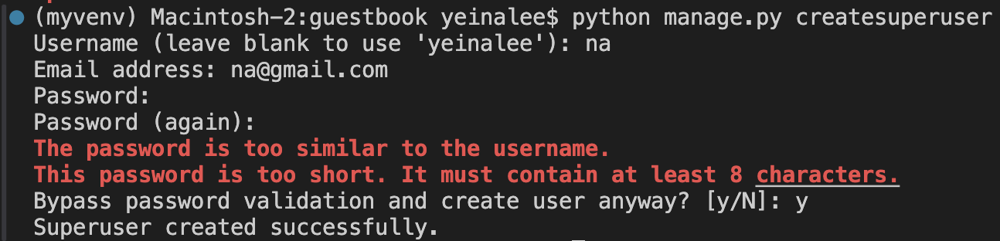

# SeminarServerAPI

프론트엔드를 위한 백엔드 운영진의 헌정 API

## 사용법

### 가상환경 실행, 장고 설치

```
source myvenv/bin/activate
pip install django
```

가상환경 만들어 놓음 -> 맥, 윈도우 노트북 관계 없이 동일한 코드 입력

### DB 만들기

```
cd ./guestbook
python manage.py makemigrations
python manage.py migrate
```

### 관리자 계정 만들기

```
python manage.py createsuperuser
```


터미널에 입력 -> 관리자 페이지(http://127.0.0.1:8000/admin/) 접속 가능

## 서버 실행

```
python manage.py runserver
```
